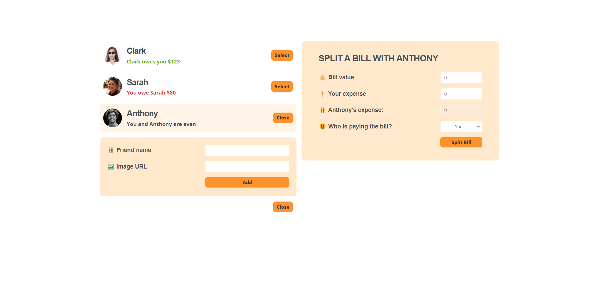

# Eat-N-Split

> An application designed to calculate the equitable distribution of expenses between you and your friend.

</img>

## Try it Live!

Check out the live app [Eat-N-Split](https://eat-n-split-demo.vercel.app/)

## How to Use

**Select a friend :**

-   Click the select button beside the friend with whom you wish to divide the bill.
-   The split bill component will appear.
-   Enter the bill and expense values, then select the payer before clicking the `Split Bill` button.
-   The app will display `Your friend owes you $` or `You owe your friend $` or `You and your friend are even`.
-   The application will present results such as `Your friend owes you $`, `You owe your friend $`, or `You and your friend are even`.

## Tools Used

-   TypeScript
-   React
-   TailwindCSS
-   Vite

## Getting Started

1. Clone this repository.

    ```bash
    git clone https://github.com/mahmoud-mohsen-dev/eat-n-split.git
    ```

2. Navigate to the Project Directory:
    ```bash
    cd eat-n-split
    ```
3. Install Dependencies:

    ```bash
     npm install
    ```

4. Start the Development Server:

    ```bash
    npm run dev
    ```

5. Open in your Browser:

    Open your web browser and go to http://localhost:3000 to see the app in action.

Now you have the "Eat-N-Split" app up and running on your local machine.

_This poject was part of The Ulitmate React Couse_
